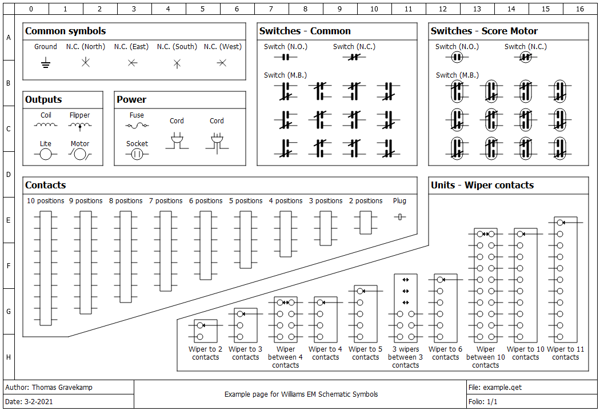

# Williams EM Schematic Symbols for QElectroTech

This is a library of Williams EM Schematic Symbols made for [QElectroTech](https://qelectrotech.org/).

## Installing

Clone _or_ download and unzip this repository in the following folder:

```
C:\Users\<your-user-name>\Application Data\qet\elements
```

(Re)start QElectrotech. This library should then be available under `Your collections`.

## Example page

A PDF version of the example document is [also included](./example.pdf) in this repository.



## License

This work is licensed under <a href="http://creativecommons.org/licenses/by-sa/4.0/?ref=chooser-v1" target="_blank" rel="license noopener noreferrer" style="display:inline-block;">CC BY-SA 4.0</a>
